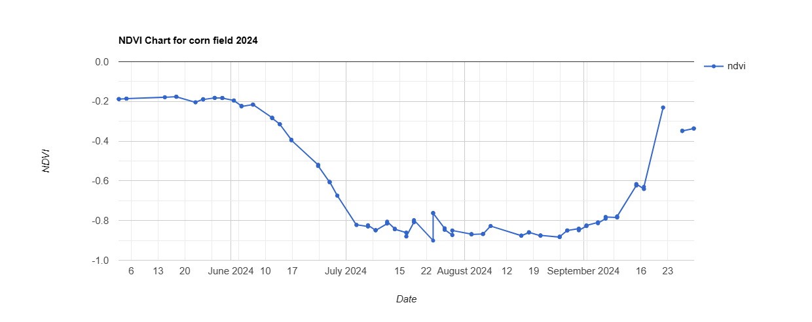
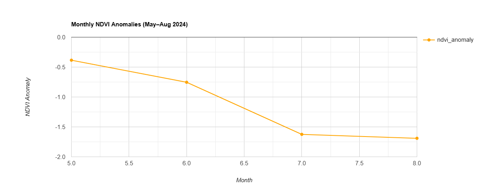
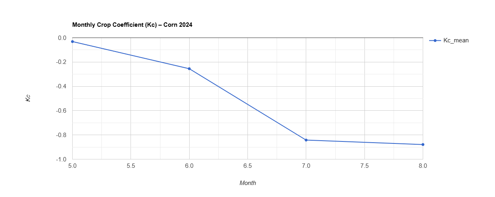
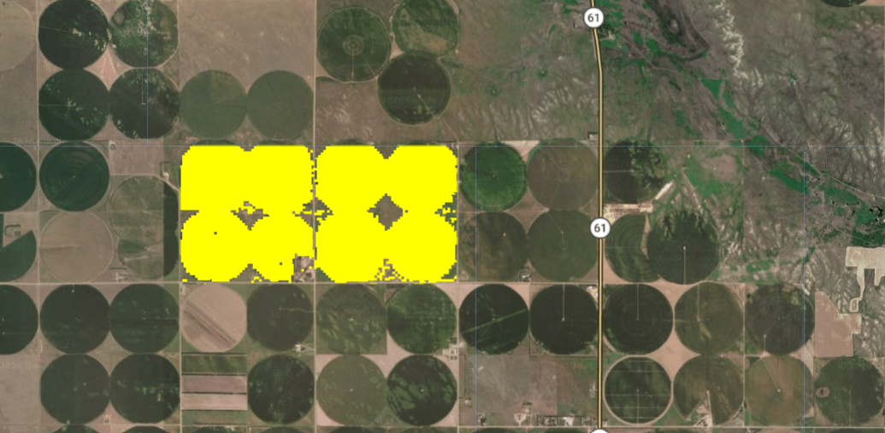

# Corn Crop Monitoring – NDVI & Irrigation Analysis

## Description
This project uses **Google Earth Engine** to monitor corn crop health, rainfall, and irrigation requirements.  
It integrates satellite imagery and climate data to provide actionable insights for farmers and agronomists.

---

## Features
- NDVI calculation for crop health monitoring  
- NDVI anomalies compared to 10-year historical data  
- Rainfall analysis using CHIRPS daily data  
- Crop coefficient (Kc) and crop evapotranspiration (ETc) calculation  
- Interactive charts and maps for data visualization  

---

## Technologies Used
- **Google Earth Engine** (JavaScript API)  
- **Satellite Imagery**: Sentinel-2, USDA Cropland Data Layer (CDL)  
- **Climate Data**: CHIRPS (rainfall), GRIDMET (ET0)  
- **Visualization**: GEE UI Charts, maps with NDVI/Kc/ETc layers  

---

## How It Works
1. Identify corn fields using USDA Cropland Data Layer (CDL).  
2. Filter Sentinel-2 images for the 2024 growing season and remove clouds.  
3. Calculate NDVI and compare to historical NDVI for anomalies.  
4. Extract daily rainfall data for the farm area.  
5. Calculate Kc using NDVI and ETc using GRIDMET data.  
6. Visualize NDVI trends, rainfall, Kc, ETc, and monthly irrigation needs using charts and maps.  

---

## Screenshots

**NDVI Over Time**  


**NDVI Anomalies**  


**Crop Coefficient (Kc)  


**ETc / Irrigation Map**  


---

## Impact / Use Cases
- Helps farmers **optimize irrigation** and water use.  
- Detects **crop stress early** using NDVI anomalies.  
- Supports **precision agriculture** and sustainable farming practices.  
- Provides **historical trend analysis** to improve planning and decision-making.  

---

## How to Use
1. Open the `.js` script files in **Google Earth Engine Code Editor**.  
2. Replace `farm` with your own field geometry.  
3. Run the scripts to generate charts and maps.  
4. Screenshots and charts can be exported for reporting or visualization.  

---

## Folder Structure

```text
corn-crop-monitoring/
├── code/             # Google Earth Engine JS scripts
│    └── ndvi_kc_etc.js
├── screenshots/      # Add your exported charts/maps here
│    ├── ndvi_chart.png
│    ├── ndvi_anomaly_chart.png
│    ├── kc_map.png
│    └── etc_chart.png
├── README.md         # This file
└── LICENSE           # Optional MIT license